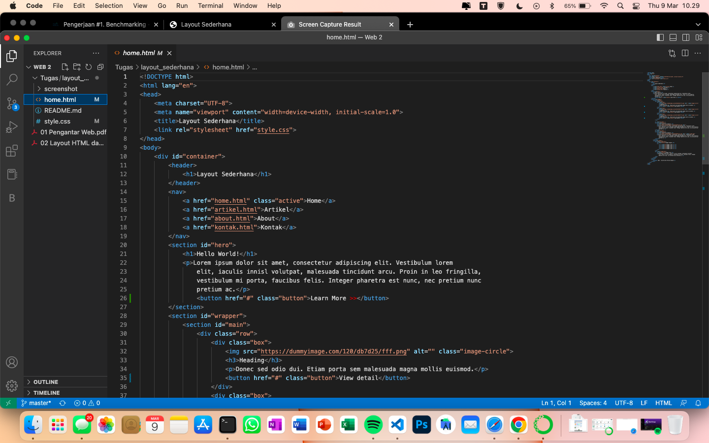
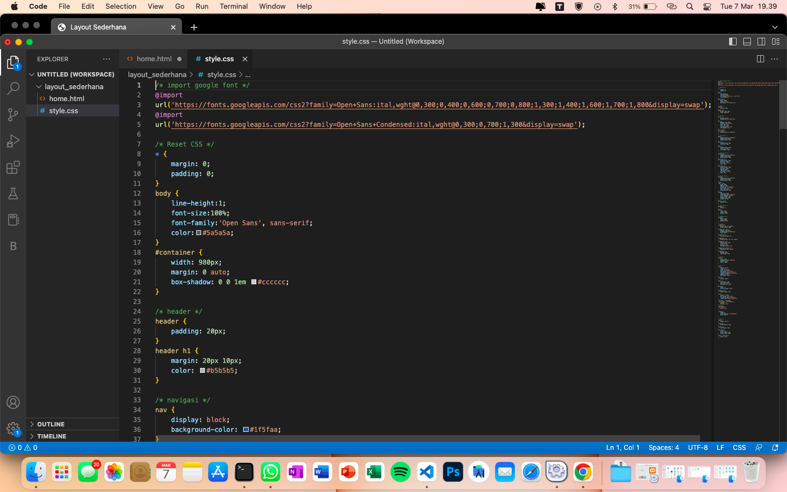
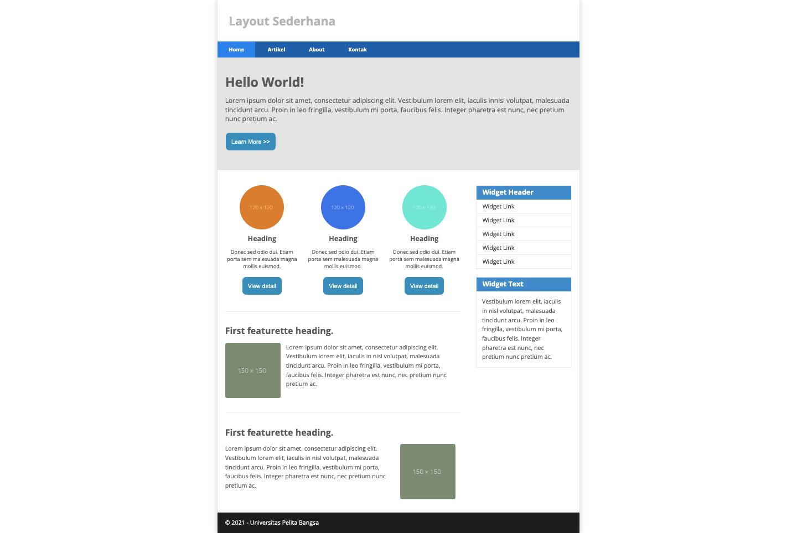

# Dibawah ini adalah penjelasan dari apa yang sudah dikerjakan

## berikut code untuk home.html agar sesuai dengan apa yang kita inginkan 
```html
<!DOCTYPE html>
<html lang="en">
<head>
    <meta charset="UTF-8">
    <meta name="viewport" content="width=device-width, initial-scale=1.0">
    <title>Layout Sederhana</title>
    <link rel="stylesheet" href="style.css">
</head>
<body>
    <div id="container">
        <header>
            <h1>Layout Sederhana</h1>
        </header>
        <nav>
            <a href="home.html" class="active">Home</a>
            <a href="artikel.html">Artikel</a>
            <a href="about.html">About</a>
            <a href="kontak.html">Kontak</a>
        </nav>
        <section id="hero">
            <h1>Hello World!</h1>
            <p>Lorem ipsum dolor sit amet, consectetur adipiscing elit. Vestibulum lorem
                elit, iaculis innisl volutpat, malesuada tincidunt arcu. Proin in leo fringilla,
                vestibulum mi porta, faucibus felis. Integer pharetra est nunc, nec pretium nunc
                pretium ac.</p>
        </section>
        <section id="wrapper">
            <section id="main">
                <div class="row">
                    <div class="box">
                        
                        <h3>Heading</h3>
                        <p>Donec sed odio dui. Etiam porta sem malesuada magna mollis euismod.</p>
                        <a href="#" class="btn btn-default">View detail</a>
                    </div>
                    <div class="box">
                        
                        <h3>Heading</h3>
                        <p>Donec sed odio dui. Etiam porta sem malesuada magna mollis euismod.</p>
                        <a href="#" class="btn btn-default">View detail</a>
                    </div>
                    <div class="box">
                        
                        <h3>Heading</h3>
                        <p>Donec sed odio dui. Etiam porta sem malesuada magna mollis euismod.</p>
                        <a href="#" class="btn btn-default">View detail</a>
                    </div>
                </div>

                <hr class="divider" />
                <article class="entry">
                    <h2>First featurette heading.</h2>
                    
                    <p>Lorem ipsum dolor sit amet, consectetur adipiscing elit. Vestibulum lorem
                        elit, iaculis in nisl volutpat, malesuada tincidunt arcu. Proin in leo fringilla,
                        vestibulum mi porta, faucibus felis. Integer pharetra est nunc, nec pretium nunc
                        pretium ac.</p>
                </article>
                <hr class="divider" />
                <article class="entry">
                    <h2>First featurette heading.</h2>
                    
                    <p>Lorem ipsum dolor sit amet, consectetur adipiscing elit. Vestibulum lorem
                        elit, iaculis in nisl volutpat, malesuada tincidunt arcu. Proin in leo fringilla,
                        vestibulum mi porta, faucibus felis. Integer pharetra est nunc, nec pretium nunc
                        pretium ac.</p>
                </article>
            </section>
            <aside id="sidebar">
                <div class="widget-box">
                    <h3 class="title">Widget Header</h3>
                    <ul>
                        <li><a href="#">Widget Link</a></li>
                        <li><a href="#">Widget Link</a></li>
                        <li><a href="#">Widget Link</a></li>
                        <li><a href="#">Widget Link</a></li>
                        <li><a href="#">Widget Link</a></li>
                    </ul>
                </div>
                <div class="widget-box">
                    <h3 class="title">Widget Text</h3>
                    <p>Vestibulum lorem elit, iaculis in nisl volutpat, malesuada tincidunt
                        arcu. Proin in leo fringilla, vestibulum mi porta, faucibus felis. Integer
                        pharetra est nunc, nec pretium nunc pretium ac.</p>
                </div>
            </aside>
        </section>
        <footer>
            <p>&copy; 2021 - Universitas Pelita Bangsa</p>
        </footer>
    </div>
</body>
</html>
```

## screenshot code



## Berikut code untuk style CSS
```css
/* import google font */
@import
url('https://fonts.googleapis.com/css2?family=Open+Sans:ital,wght@0,300;0,400;0,600;0,700;0,800;1,300;1,400;1,600;1,700;1,800&display=swap');
@import
url('https://fonts.googleapis.com/css2?family=Open+Sans+Condensed:ital,wght@0,300;0,700;1,300&display=swap');

/* Reset CSS */
* {
    margin: 0;
    padding: 0;
}
body {
    line-height:1;
    font-size:100%;
    font-family:'Open Sans', sans-serif;
    color:#5a5a5a;
}
#container {
    width: 980px;
    margin: 0 auto;
    box-shadow: 0 0 1em #cccccc;
}

/* header */
header {
    padding: 20px;
}
header h1 {
    margin: 20px 10px;
    color: #b5b5b5;
}

/* navigasi */
nav {
    display: block;
    background-color: #1f5faa;
}
nav a {
    padding: 15px 30px;
    display: inline-block;
    color: #ffffff;
    font-size: 14px;
    text-decoration: none;
    font-weight: bold;
}
nav a.active,
nav a:hover {
    background-color: #2b83ea;
}

/* Hero Panel */
#hero {
    background-color: #e4e4e5;
    padding: 50px 20px;
    margin-bottom: 20px;
}
#hero h1 {
    margin-bottom: 20px;
    font-size: 35px;
}
#hero p {
    margin-bottom: 20px;
    font-size: 18px;
    line-height: 25px;
}

/* Introduce Panel */
#introduce{
    background-color: #e4e4e5;
    padding: 50px 20px;
    margin-bottom: 20px;
}
#introduce h1 {
    margin-bottom: 10px;
    font-size: 35px;
    position: relative;
    left: 15px;
}
#introduce p {
    margin-bottom: 20px;
    font-size: 18px;
    padding: 30px;
    line-height: 25px;
    position: relative;
    left: 15px;
}

/* Contact Panel */
#kontak{
    background-color: #e4e4e5;
    padding: 20px 20px;
    margin-bottom: 20px;
}
.input,
.msg, .area{
    width: 100%;
    padding: 10px;
    border: 2px solid white;
    box-sizing: border-box;
    font-size: 15px;
    margin-bottom: 20px;
}
button{
    font-size: 14px;
    background-color: #3f3f3f;
    color: rgb(59, 58, 58);
    border-radius: 5px;
    padding: 10px 20px;
    margin-top: 8x;
}
button :hover{
    opacity: 0,9;
}

/* main content */
#wrapper {
    margin: 0;
}
#main {
    float: left;
    width: 640px;
    padding: 20px;
}

/* sidebar area */
#sidebar {
    float: right;
    width: 260px;
    padding: 20px;
}

/* widget */
.widget-box {
    border: 1px solid #eee;
    margin-bottom: 20px;
}
.widget-box .title {
    padding: 10px 16px;
    background-color: #428bca;
    color: #fff;
}
.widget-box ul {
    list-style-type:none;
}
.widget-box li {
    border-bottom: 1px solid  #eee;
}
.widget-box li a {
    padding: 10px 16px;
    color: #333;
    display: block;
    text-decoration: none;
}
.widget-box li:hover a {
    background-color: #eee;
}
.widget-box p {
    padding: 15px;
    line-height: 25px;
}

/* footer */
footer {
    clear: both;
    background-color: #1d1d1d;
    padding: 20px;
    color:  #eee
}

/* box */
.box {
    display: block;
    float: left;
    width: 33.333333%;
    box-sizing: border-box;
    -moz-box-sizing: border-box;
    -webkit-box-sizing: border-box;
    padding: 0 10px;
    text-align: center;
}
.box h3 {
    margin: 15px 0;
}
.box p {
    line-height: 20px;
    font-size: 14px;
    margin-bottom: 15px;
}
box img {
    border: 0;
    vertical-align: middle;
}
.image-circle {
    border-radius: 50%;
}
.row {
    margin: 0 -10px;
    box-sizing: border-box;
    -moz-box-sizing: border-box;
    -webkit-box-sizing: border-box;
}
.row:after, .row:before,
.entry:after, .entry:before {
    content: '';
    display: table;
}
.row:after,
.entry:after {
    clear: both;
}

.divider {
    border:0;
    border-top:1px solid #eeeeee;
    margin:40px 0;

}

/* entry */
.entry {
    margin: 15px 0;
}
.entry h2 {
    margin-bottom: 20px;
}
.entry p {
    line-height: 25px;
}
.entry img {
    float: left;
    border-radius: 5px;
    margin-right: 15px;
}
.entry .right-img {
    float: right;
}
```

## screenshot code untuk CSS


## tampilan hasil web layout sederhana

